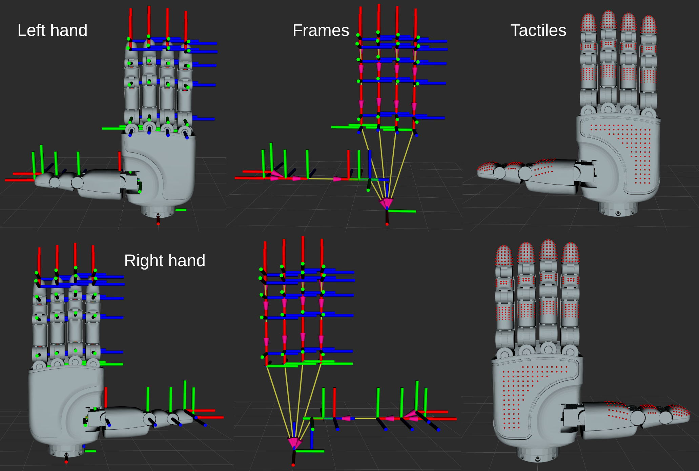

# Apex Hand Description

URDF description package for the Apex dexterous hand: models, meshes, tactile point data, and a visualization viewer.



## Repository Structure

```
apex_hand/
├── urdf/
│   ├── apex_hand_left/                    Left hand (base + tactile URDF variants + 49 STLs)
│   └── apex_hand_right/                   Right hand
├── tactile/                               Tactile data and processing scripts
├── rviz/                                  URDF visualization viewer
├── images/                                Documentation images
```

| Doc | Contents |
|---|---|
| [apex_hand/tactile/README.md](apex_hand/tactile/README.md) | Tactile point distribution, sensors data format, remap.json, processing script usage |
| [apex_hand/rviz/README.md](apex_hand/rviz/README.md) | Requirements, installation, and usage of the RViz URDF viewer |

## Joint Parameters

The left and right hands share identical joint names and parameters, with 21 revolute joints in total. Thumb j4 is coupled with j3, and the four fingers' j3 is coupled with j2 (angles are always equal); they are still modeled as independent joints in the URDF, with the coupling enforced on the simulation and control side. The SDK enums are defined in `sdk/include/rysen_apexhand_data.hpp`; enum values 0–20 follow the same order as the table below.

| Joint | SDK Enum | lower (rad) | upper (rad) | effort (N·m) | velocity (rad/s) | Notes |
|---|---|---|---|---|---|---|
| thumb_j0 | `JOINT_ID_THUMB_J0` | 0 | 1.5707 (90°) | 1.2 | 6.9813 (400°/s) | |
| thumb_j1 | `JOINT_ID_THUMB_J1` | -0.1745 (-10°) | 1.0471 (60°) | 0.6 | 6.9813 (400°/s) | |
| thumb_j2 | `JOINT_ID_THUMB_J2` | 0 | 1.396 (80°) | 2.3 | 6.9813 (400°/s) | |
| thumb_j3 | `JOINT_ID_THUMB_J3` | -0.349 (-20°) | 1.396 (80°) | 1.0 | 6.9813 (400°/s) | |
| thumb_j4 | `JOINT_ID_THUMB_J4` | -0.349 (-20°) | 1.396 (80°) | 1.0 | 6.9813 (400°/s) | Coupled with j3 |
| index_j0 | `JOINT_ID_INDEX_J0` | -0.4363 (-25°) | 0.4363 (25°) | 2.0 | 6.9813 (400°/s) | |
| index_j1 | `JOINT_ID_INDEX_J1` | -0.349 (-20°) | 1.5707 (90°) | 3.2 | 6.9813 (400°/s) | |
| index_j2 | `JOINT_ID_INDEX_J2` | -0.0872 (-5°) | 1.7453 (100°) | 1.0 | 6.9813 (400°/s) | |
| index_j3 | `JOINT_ID_INDEX_J3` | -0.0872 (-5°) | 1.7453 (100°) | 1.0 | 6.9813 (400°/s) | Coupled with j2 |
| middle_j0 | `JOINT_ID_MIDDLE_J0` | -0.4363 (-25°) | 0.4363 (25°) | 2.0 | 6.9813 (400°/s) | |
| middle_j1 | `JOINT_ID_MIDDLE_J1` | -0.349 (-20°) | 1.5707 (90°) | 3.2 | 6.9813 (400°/s) | |
| middle_j2 | `JOINT_ID_MIDDLE_J2` | -0.0872 (-5°) | 1.7453 (100°) | 1.0 | 6.9813 (400°/s) | |
| middle_j3 | `JOINT_ID_MIDDLE_J3` | -0.0872 (-5°) | 1.7453 (100°) | 1.0 | 6.9813 (400°/s) | Coupled with j2 |
| ring_j0 | `JOINT_ID_RING_J0` | -0.4363 (-25°) | 0.4363 (25°) | 2.0 | 6.9813 (400°/s) | |
| ring_j1 | `JOINT_ID_RING_J1` | -0.349 (-20°) | 1.5707 (90°) | 3.2 | 6.9813 (400°/s) | |
| ring_j2 | `JOINT_ID_RING_J2` | -0.0872 (-5°) | 1.7453 (100°) | 1.0 | 6.9813 (400°/s) | |
| ring_j3 | `JOINT_ID_RING_J3` | -0.0872 (-5°) | 1.7453 (100°) | 1.0 | 6.9813 (400°/s) | Coupled with j2 |
| pinky_j0 | `JOINT_ID_PINKY_J0` | -0.4363 (-25°) | 0.4363 (25°) | 2.0 | 6.9813 (400°/s) | |
| pinky_j1 | `JOINT_ID_PINKY_J1` | -0.349 (-20°) | 1.5707 (90°) | 3.2 | 6.9813 (400°/s) | |
| pinky_j2 | `JOINT_ID_PINKY_J2` | -0.0872 (-5°) | 1.7453 (100°) | 1.0 | 6.9813 (400°/s) | |
| pinky_j3 | `JOINT_ID_PINKY_J3` | -0.0872 (-5°) | 1.7453 (100°) | 1.0 | 6.9813 (400°/s) | Coupled with j2 |

The SDK also provides anatomical alias enums (same values as the table above): `JOINT_ID_THUMB_CMC_ABD` = `JOINT_ID_THUMB_J0`, `JOINT_ID_INDEX_MCP_FLEX` = `JOINT_ID_INDEX_J1`, etc. (CMC/MCP/PIP/DIP suffixes); the pinky's alias prefix uses `LITTLE` (also `FINGER_ID_LITTLE` in `FingerId`).

## Tactiles

Each hand has **619 tactile points** distributed across 16 tactile pad links. For data sources, array mapping, and processing scripts, see [apex_hand/tactile/README.md](apex_hand/tactile/README.md).

## RViz Viewer

Single-file, one-command launch, no colcon build required:

```bash
python3 apex_hand/rviz/rviz_viewer.py                          # Left hand, static zero pose
python3 apex_hand/rviz/rviz_viewer.py --side right --tactile   # Right hand with tactile points
python3 apex_hand/rviz/rviz_viewer.py --slider                 # Add joint slider window
```

For requirements and installation, see [apex_hand/rviz/README.md](apex_hand/rviz/README.md).
